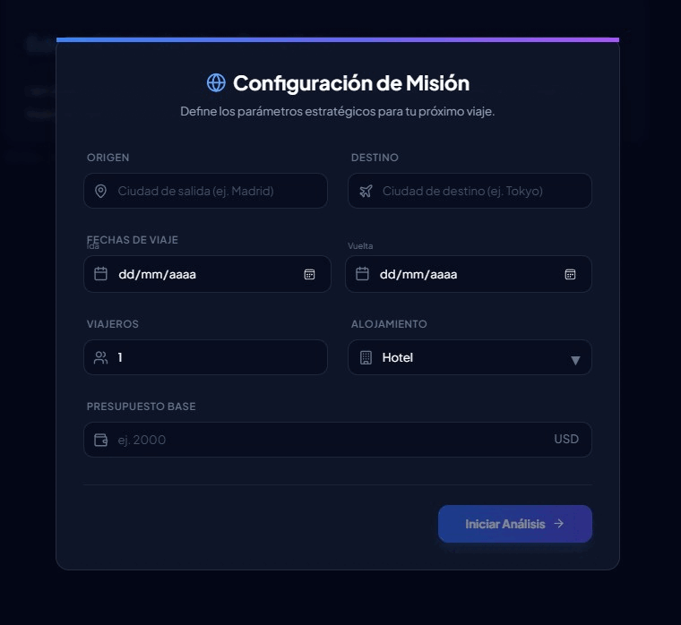

<div align="center">

</div>

# Edwin AI - Financial Travel Consultant

**Edwin AI** is a sophisticated, AI-powered travel consultant designed to provide intelligent financial analysis and optimized travel planning. This application leverages the power of the Google Gemini API to deliver a seamless, interactive experience for planning your next journey, focusing on budget optimization and logistical efficiency.

Users can input their travel parameters through a sleek, modern interface, and the AI agent will perform a detailed analysis to suggest the best flights, accommodations, and points of interest, complete with booking links and interactive maps.

<div align="center">

</div>


## ✨ Key Features

- **✈️ Intelligent Trip Configuration**: A dedicated dashboard to input origin, destination, dates, traveler numbers, accommodation preferences, and budget.
- **🤖 AI-Powered Analysis**: Utilizes Google's Gemini model with function calling to gather and process travel data in real-time.
- **💬 Interactive Chat Interface**: Engage in a conversation with the AI to refine and adjust your travel plans.
- **🗺️ Interactive Map Visualization**: Automatically renders embedded Google Maps for any location mentioned in the chat using a custom `[MAP:Location]` syntax.
- **🔗 Real-time Booking Links**: Mock tool implementations provide realistic booking links for flights and lodging from popular services like Kayak and Booking.com.
- **📄 Rich Markdown Responses**: AI responses are beautifully rendered with support for tables, lists, links, and more for clear and organized information.
- **💅 Sleek, Modern UI**: A responsive and visually appealing interface built with React and Tailwind CSS, featuring animations and a dark mode theme.

## 🏗️ Architecture Overview

The application is a **React-based Single Page Application (SPA)** built with Vite, ensuring a fast and modern development experience.

1.  **UI Components**: The user interface is built with React components. The main component, `ChatInterface.tsx`, orchestrates the entire user experience, managing state for the configuration dashboard and the chat view.
2.  **State Management**: Local state is managed within the `ChatInterface` component using React's `useState` hook. This keeps the application logic contained and easy to follow for this project's scale.
3.  **Gemini Service (`geminiService.ts`)**: This service is the bridge between the frontend and the Google Gemini API.
    - It initializes the chat session with a system prompt (`EDWIN_SYSTEM_INSTRUCTION`) that defines the AI's persona, capabilities, and response format.
    - It defines the `tools` (function declarations) that the Gemini model can use, such as `search_flights`, `search_lodging`, and `get_poi_info`.
    - The `sendMessage` function handles the conversation flow, including processing the model's `functionCalls` and sending back the results from the mock tools.
4.  **Mock Tools (`mockTools.ts`)**: For development and demonstration purposes, this file simulates real-world API calls. It contains functions that generate mock data for flights, lodging, and points of interest, complete with realistic pricing, details, and dynamic booking links. This allows the application to be fully functional without requiring access to live (and costly) travel APIs.
5.  **Custom Markdown Rendering**: The `MarkdownRenderer.tsx` component extends the standard `react-markdown` library to parse custom syntax like `[MAP:Location]`, dynamically injecting `MapViewer.tsx` components into the AI's response.

## 🛠️ Technology Stack

- **Frontend Framework**: [React 19](https://react.dev/)
- **Build Tool**: [Vite](https://vitejs.dev/)
- **Language**: [TypeScript](https://www.typescriptlang.org/)
- **AI**: [Google Gemini API](https://ai.google.dev/) (`@google/genai`)
- **UI Styling**: [Tailwind CSS](https://tailwindcss.com/) (with custom configuration)
- **Icons**: [Lucide React](https://lucide.dev/)
- **Markdown**: [React Markdown](https://github.com/remarkjs/react-markdown) with `remark-gfm`.

## 🚀 Getting Started

Follow these steps to run the application locally.

### Prerequisites

- [Node.js](https://nodejs.org/) (v18 or higher recommended)
- A valid [Google Gemini API Key](https://ai.google.dev/pricing)

### Installation & Setup

1.  **Clone the repository:**
    ```bash
    git clone <repository-url>
    cd <repository-directory>
    ```

2.  **Install dependencies:**
    ```bash
    npm install
    ```

3.  **Set up your environment variables:**
    Create a file named `.env.local` in the root of the project and add your Gemini API key:
    ```env
    GEMINI_API_KEY="YOUR_API_KEY_HERE"
    ```

4.  **Run the development server:**
    ```bash
    npm run dev
    ```
    The application will be available at `http://localhost:3000`.

### Available Scripts

- `npm run dev`: Starts the Vite development server.
- `npm run build`: Bundles the application for production.
- `npm run preview`: Serves the production build locally.

## ⚙️ How It Works: The AI Engine

The core of this application is the interaction between the user, the Gemini model, and the defined tools.

1.  **Initial Prompt**: When the user fills out the trip configuration and clicks "Iniciar Análisis", a detailed prompt is constructed and sent to the Gemini model.
2.  **Function Calling**: The model, guided by the system instructions, determines that it needs more information to fulfill the request. It issues one or more `functionCalls` (e.g., `search_flights` with arguments like `origin: "Madrid"` and `destination: "Tokyo"`).
3.  **Tool Execution**: The `geminiService` intercepts these calls and executes the corresponding functions in `mockTools.ts`.
4.  **Response Generation**: The results from the mock tools (e.g., a list of flight offers) are sent back to the model.
5.  **Final Answer**: The Gemini model uses this new information to formulate a comprehensive answer, including analysis, tables, and booking links, which is then streamed back to the user in the chat interface.

## 📂 File Structure

Here is a brief overview of the key files and directories:

```
/
├── .env.local             # Environment variables (contains API Key)
├── index.html             # Main HTML entry point, includes Tailwind CSS config
├── package.json           # Project dependencies and scripts
├── vite.config.ts         # Vite configuration file
├── tsconfig.json          # TypeScript compiler options
├── App.tsx                # Root React component
├── index.tsx              # React entry point
├── constants.ts           # System prompt and tool definitions for the AI
├── types.ts               # TypeScript type definitions for the app
│
├── components/
│   ├── ApiKeyModal.tsx    # Modal to show if API key is missing
│   ├── ChatInterface.tsx  # The core UI component for chat and configuration
│   ├── MapViewer.tsx      # Component to display the embedded Google Map
│   └── MarkdownRenderer.tsx # Renders markdown and handles custom [MAP:] syntax
│
└── services/
    ├── geminiService.ts   # Manages all interactions with the Gemini API
    └── mockTools.ts       # Mock implementations of the tools for flights, lodging, etc.
```
